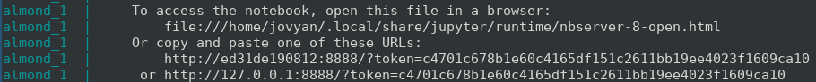

# Introduccion a la programacion funcional para procesamiento en streaming (usando scala + akka-streams)

## Requerimientos
* docker
* docker-compose  

## Corriendo docker-composer

> docker-compose up

### Abrir Jupyter Notebook / Almond

* Buscar en la consola la informacion del host de Jupyter (esta al principio del log). Empieza con: http://127.0.0.1:8888/?token=XXXXXXXXXXXXXX
* Copiar link y pegar en navegador o hacer click derecho -> abrir (gnome-terminal). Es importante que incluya el token completo.
* los notebooks se encuentran en la carpeta work.
  * scala-fp-streaming: introduccion a la programacion funcional para hacer procesar streaming.
  * rabbitmq-producer: productor basico para hacer pruebas.
  * akka-streams: esqueleto de aplicacion con akka-streams.

### Abrir RabbitMQ Management UI
* ingresar en http://127.0.0.1:15672/
  * username: guest
  * password: guest

## Detener

Pulsar ctrl+c en el terminal.

## Eliminar

> docker-compose rm -f